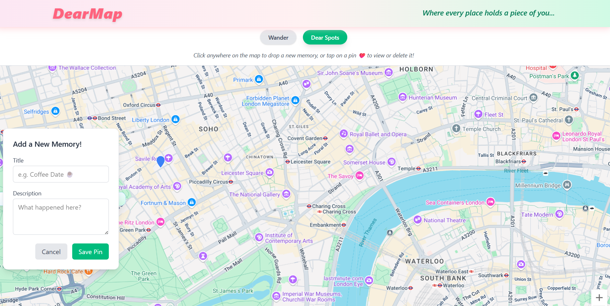
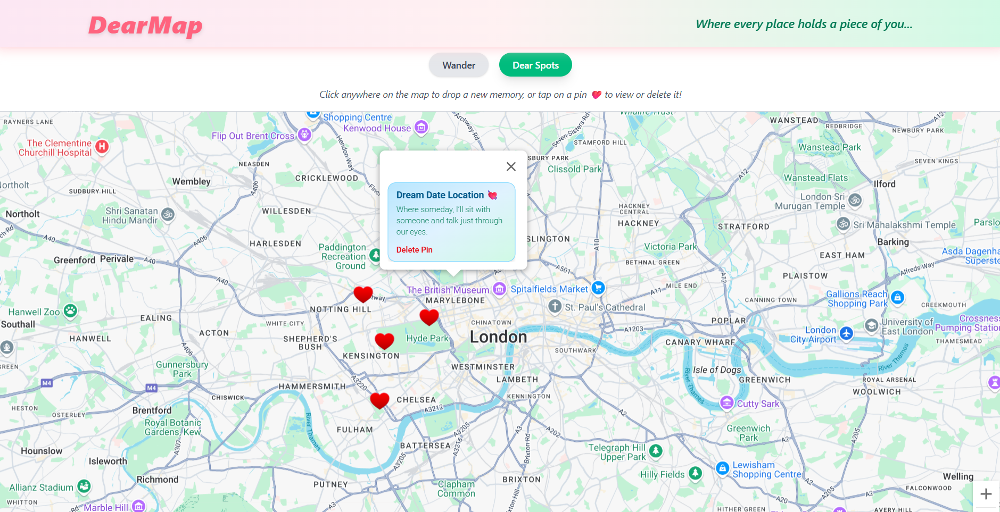
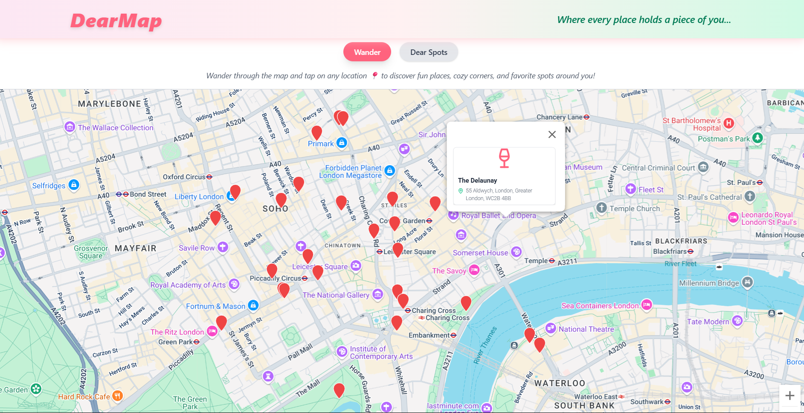
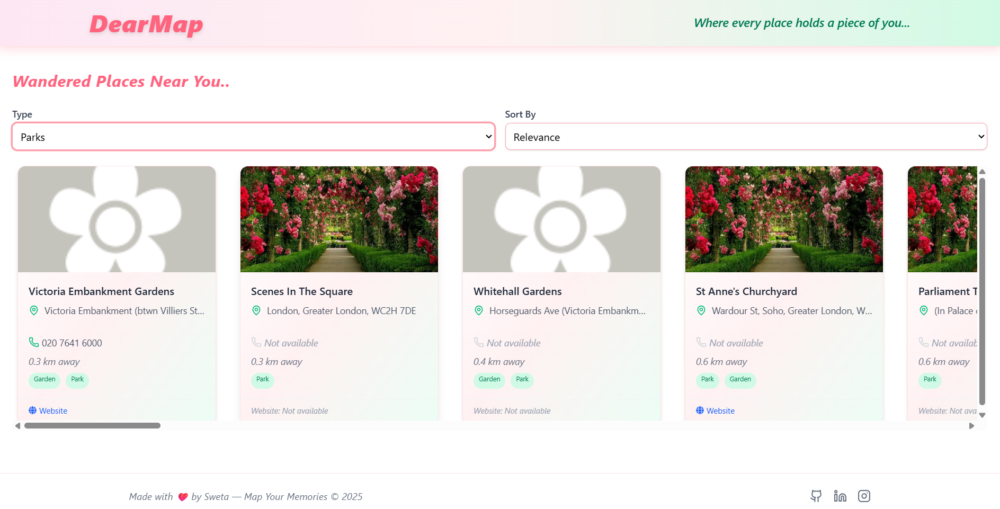

# DearMap

**DearMap** is a playful and creative memory-mapping app that lets users drop pins on a map to mark meaningful moments, emotions, and stories — all visually. It’s designed to bring your memories to life on an interactive map.

> ✨ “Map your laughter, love, and longing.”

---

---

## 🌟 Features

- 🧠 Drop personal memories with title + description on map pins
- 📍 View and delete saved memories on click
- ❤️ Discover interesting local spots nearby using Foursquare API
- ✨ Smooth transitions with Framer Motion
- 🌍 Fully responsive & mobile-friendly
- 🗄️ API key securely handled via Express proxy server

---

## 🛠️ Tech Stack

- **React + Vite** – Fast and modern frontend development
- **Tailwind CSS** – Utility-first styling framework
- **Framer Motion** – For elegant animations
- **Google Maps API** – To visualize and drop memory pins on the map
- **Foursquare Places API** – For places data
- **Firebase** – For backend database (CRUD)
- **Node.js (Express)** – Proxy server to securely handle API requests
- **Render** – For hosting the Express server
- **Vercel** – For deploying the frontend

---

## 🔥 Screenshots

### 🎯 Drop a Memory on the Map

### 🧡 View & Delete Saved Pins

### 🏞️ Discover Places Nearby

### 🎨 Category-based Filtering

---

## 🚀 Live Demo

👉 [Visit the app](https://dearmap.vercel.app)

---

## 🔐 API & Server

This app uses a custom [Express Proxy Server](https://github.com/SwetaJaiswal9/dearmap-server) hosted on Render to securely call the Foursquare Places API without exposing API keys.

---

  Made with 🩷 by <a href="https://sweta-jaiswal-portfolio.vercel.app/" target="_blank">Sweta</a>

